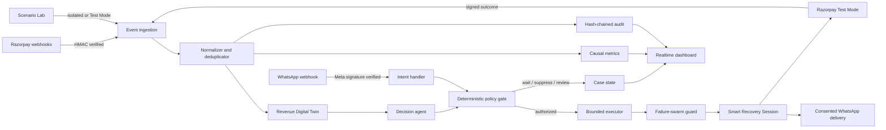

# PayArc

**AI revenue recovery that knows when to act, when to wait, and when to stop.**

PayArc is a zero-trust revenue-recovery control plane built for the Razorpay AI Buildathon. It watches signed payment and revenue events, diagnoses money at risk, chooses the least disruptive safe intervention, executes bounded recovery workflows, and proves how much revenue the intervention actually recovered.

It covers payment failures, checkout abandonment, failed subscriptions and mandates, overdue B2B receivables, consent-aware WhatsApp recovery, promise-to-pay tracking, and provider-wide payment degradation.

## The problem

Revenue loss is not one event. A payment can fail because a bank is temporarily unavailable, a customer can abandon an active checkout, a mandate can exhaust its retries, or an invoice can remain unpaid because the merchant must fix a blocker. Blindly sending every customer another payment link creates duplicate-payment risk, customer fatigue, unnecessary provider traffic, and misleading recovery numbers.

PayArc closes the loop:

1. Detect revenue at risk from verified Razorpay events or a controlled scenario.
2. Join related events into one durable revenue obligation.
3. Diagnose the failure and its likely owner.
4. Estimate natural recovery and the incremental value of intervening.
5. Ask the configured AI model for a structured next-best action.
6. Authorize that recommendation through deterministic financial policy.
7. Preserve a valid checkout or provider retry before creating a replacement.
8. Deliver the safe path automatically through a consented channel.
9. Stop on payment, opt-out, expiry, fatigue limits, pause, or risk escalation.
10. Count recovery only after a signed and provider-verified outcome.

The merchant handles exceptions; PayArc handles the normal volume automatically.

## What makes PayArc different

### Recovery Decision Passport

Every recommendation carries an explainable passport:

- **Causal proof** compares the treatment cohort with a deterministic holdout so natural recovery is not falsely claimed.
- **Path conservation** reuses an active checkout or provider-managed retry before creating another payment path.
- **Safety envelope** records verified amount, currency, expiry, contact limits, approval requirements, idempotency, and stopping rules.
- **Counterfactual** shows what PayArc expects to happen if it waits versus intervenes.

### Permanent Smart Recovery Session

Customers receive one stable PayArc URL per obligation, such as `/recover/:sessionId`. The destination behind it can change safely without sending another message. It can wait through a provider incident, reuse an existing checkout, prefer UPI after a customer reply, open the currently authorized Razorpay Test Mode checkout, or become a paid receipt after verification.

### Failure swarms

When at least three matching transient failures appear within two minutes, PayArc treats them as one provider incident instead of unrelated customer failures. It holds unsafe retries, waits for five quiet minutes, then releases a 25% canary before reopening the cohort. This prevents a retry storm while preserving recoverable demand.

### Intent-aware WhatsApp recovery

The recipient is resolved just in time from Razorpay order/payment data; the merchant does not type a phone number for every case. Outbound delivery is idempotent and consent-gated. Signed inbound replies understand `STOP`, promise-to-pay, UPI preference, and already-paid claims. A financial claim is verified against Razorpay before a case is closed.

### Customer-wide fatigue budgets

Contact limits are enforced atomically across all cases for the same customer, not only within one transaction. Concurrent workers cannot accidentally exceed the budget.

## Implemented capabilities

- Razorpay-style responsive merchant dashboard with URL-persistent navigation and case drawers
- Fastify and TypeScript orchestration API
- Durable SQLite events, obligation-backed cases, decisions/actions, event jobs, sessions, incidents, promises, and audit records
- Raw-body Razorpay HMAC verification, secret rotation, replay protection, deduplication, and out-of-order handling
- Payment, order, subscription, payment-link, and payment-downtime event normalization for the 15-event signed webhook boundary
- Groq free-model and OpenAI structured decision adapters with deterministic fallback
- Deterministic policy gate for cooldowns, approval thresholds, currency, opt-out, fatigue, pause, kill switch, and value limits
- Real Razorpay Test Mode order creation, payment lookup, invoice lookup, Payment Link reuse/create/fetch/cancel, and outcome verification
- Automatic bounded workers, scheduled retries, and exception-only human review
- Smart Recovery Sessions, failure-swarm circuit breakers, WhatsApp automation, and promise tracking
- Treatment/control assignment, causal uplift, protected revenue, and incremental recovered-revenue metrics
- Hash-chained audit ledger and failure-focused Security Center
- Dual-mode Scenario Lab with isolated simulations and real Razorpay Test Mode Checkout flows
- Authenticated server-sent events for live dashboard synchronization
- No persisted plaintext phone number, email address, inbound message body, API secret, or webhook secret

## Architecture



### Trust boundary

The AI model is a constrained decision component, not the authority over money or communication. It receives redacted case features and returns a validated schema containing an action, confidence, explanation, delay, and approval signal. It never receives Razorpay or WhatsApp credentials and cannot call providers directly.

The deterministic policy layer owns authorization. It can reject or transform an AI recommendation because of consent, customer fatigue, provider health, an active checkout, cohort assignment, duplicate-debit risk, value threshold, currency, pause, or kill-switch state. The executor runs only an authorized action with an idempotency key.

### Main runtime components

| Component | Responsibility |
| --- | --- |
| Webhook ingress | Verify raw signatures before parsing and acknowledge durable receipt quickly |
| Event processor | Normalize provider events, redact PII, deduplicate, and update the obligation twin |
| Decision agent | Classify the situation and propose the next-best recovery action |
| Policy engine | Enforce deterministic money, consent, timing, and safety rules |
| Autopilot worker | Claim event jobs atomically and execute scheduled actions with bounded concurrency and idempotency |
| Razorpay adapter | Resolve facts and create/reuse Test Mode payment paths |
| Smart Session | Keep one stable customer URL synchronized with the current safe path |
| Swarm controller | Correlate provider degradation and stage traffic recovery |
| WhatsApp adapter | Send approved messages and process signed customer intent |
| Outcome verifier | Confirm paid/partial/expired/cancelled states before changing money metrics |
| Audit ledger | Append tamper-evident evidence for every important transition |
| Realtime API | Push case and metric changes to connected merchant dashboards |

See [Architecture](./docs/ARCHITECTURE.md) for state machines, concurrency rules, failure handling, and deployment evolution.

## End-to-end workflow

### 1. Ingest

Razorpay posts to `POST /webhooks/razorpay`. PayArc verifies `X-Razorpay-Signature` against the exact raw body, supports the current and previous secret during rotation, rejects invalid requests, and stores a redacted event with a provider-event deduplication key.

### 2. Build the obligation

The event is mapped to one revenue obligation. Related payments, orders, links, invoices, subscriptions, promises, and checkout attempts are joined so repeated notifications do not create duplicate revenue at risk.

### 3. Diagnose

PayArc classifies failures as transient provider, customer-actionable, invalid payment method, merchant-actionable, risk/compliance, subscription/mandate exhaustion, abandonment, or receivable delinquency. Provider downtime signals also update the payment-intelligence circuit breaker.

### 4. Decide

The selected AI adapter proposes a structured intervention. When no model is configured or the model is unavailable, the deterministic decision engine keeps the workflow functional. The portfolio optimizer ranks work by expected incremental value after natural recovery, cost, fatigue, and duplicate-debit risk.

### 5. Authorize

The policy engine assigns deterministic treatment/control cohorts and checks consent, opt-out, recent contact count, cooldown, provider health, active checkout state, allowed currency, case value, approval requirement, and global automation controls.

### 6. Execute automatically

Safe actions are scheduled and claimed by the autopilot. A valid checkout is reused first. A provider-managed retry is observed when appropriate. A bounded replacement Razorpay Payment Link is created only as a last resort. The Smart Recovery Session is updated, and an eligible consented customer receives it through WhatsApp without merchant data entry.

### 7. Interpret customer intent

Signed WhatsApp replies can suppress the matching recovery case, create a promise-to-pay, set UPI preference, or trigger verification of an already-paid claim. Free text and plaintext contact details are not persisted.

### 8. Verify and stop

Signed Razorpay outcome events are reconciled with provider state. Payment, expiry, cancellation, opt-out, fatigue limits, policy rejection, or a merchant pause stops further work. A paid obligation makes further actions ineligible and turns its Smart Session into a verified receipt.

### 9. Prove impact

The dashboard separates gross recovery from incremental recovery, compares treatment with holdout, displays protected revenue and prevented retries, and links every transition to the hash-chained audit ledger.

## Recovery domains

| Domain | Detection | Typical safe response |
| --- | --- | --- |
| Payment degradation | clustered failures or downtime webhooks | hold cohort, wait, 25% canary, reopen gradually |
| Checkout abandonment | active session without completion | observe, reuse checkout, then last-resort replacement |
| Failed subscription | invoice/charge failure and retry state | respect provider schedule, sequence only the next safe step |
| Mandate recovery | exhausted or pending mandate attempts | avoid duplicate debit, delay or request an alternate path |
| B2B receivables | overdue invoice state registered in the Digital Twin/API | fix merchant blocker, contact payer, record promise, reconcile |
| WhatsApp/voice intent | signed inbound customer response | opt out, promise-to-pay, payment preference, verify paid claim |

## Merchant dashboard

| Page | What the merchant uses it for |
| --- | --- |
| Overview | Portfolio at risk, incremental recovery, protected revenue, promises, and audit health |
| Portfolio optimizer | Ranked obligations and bounded batch execution |
| Payment intelligence | Provider degradation, active swarms, held traffic, and canary release |
| Checkout journeys | Active/abandoned sessions and conserved checkout paths |
| Recurring revenue | Subscription and mandate retry state |
| B2B receivables | Overdue invoices, blockers, contacts, promises, and reconciliation |
| Promises & voice | Promise-to-pay and consent-aware conversation status |
| Recovery cases | Evidence, passport, timers, execution, Smart Link, delivery, pause, and suppression |
| Scenario Lab | Safe mock scenarios plus real Razorpay Test Mode proof flows |
| Events & audit | Signed event history and hash-chain validation |
| Analytics | Treatment-versus-holdout causal recovery metrics |
| Security Center | Fail-closed signature, replay, injection, and audit-tampering demonstrations |
| Integrations | Razorpay, webhook, AI, WhatsApp, and worker readiness |
| Operator Guide | Page-by-page workflow and seven-minute judge demo |

The detailed button and status guide is in [Operator Guide](./docs/USER_GUIDE.md).

## Quick start

Requirements: Node.js 24 or newer.

```bash
npm install
cp .env.example .env
npm test
npm run build:ui
npm run dev
```

Open <http://127.0.0.1:3000>. The default mock mode needs no external credentials and keeps all provider operations isolated.

For frontend hot reload, keep the API running and execute `npm run dev:ui` in another terminal, then open <http://127.0.0.1:5173>.

Seed a richer local portfolio with:

```bash
npm run demo:seed
```

## Razorpay Test Mode setup

1. Switch the Razorpay Dashboard to **Test Mode**.
2. Open **Account & Settings → Websites & API Keys** and generate a Test key.
3. Add a webhook such as `https://your-public-host/webhooks/razorpay` with a separate strong secret.
4. Subscribe only to supported demo events: payment authorized/failed/captured, order paid, subscription pending/halted/charged/activated, Payment Link paid/partially paid/expired/cancelled, and payment-downtime started/updated/resolved.
5. Configure `.env`:

```dotenv
PAYMENT_PROVIDER_MODE=razorpay
PUBLIC_BASE_URL=https://your-public-host.example
RAZORPAY_KEY_ID=rzp_test_...
RAZORPAY_KEY_SECRET=...
RAZORPAY_WEBHOOK_SECRET=...
AUTO_ACTIONS_ENABLED=true
EXTERNAL_ACTIONS_ENABLED=true
```

Never use the API key secret as the webhook secret. If using ngrok, `PUBLIC_BASE_URL` must be the current HTTPS origin. Do not include `/webhooks/razorpay`; PayArc appends the route where needed. `EXTERNAL_ACTIONS_ENABLED=true` is required to let PayArc create a real Test Mode recovery path; leave it `false` when you want a read-only integration check.

### Signed Razorpay event coverage

PayArc currently admits these exact event types at the signed webhook boundary:

| Area | Events |
| --- | --- |
| Payment | `payment.failed`, `payment.authorized`, `payment.captured`, `order.paid` |
| Provider health | `payment.downtime.started`, `payment.downtime.updated`, `payment.downtime.resolved` |
| Recurring | `subscription.pending`, `subscription.halted`, `subscription.charged`, `subscription.activated` |
| Recovery outcome | `payment_link.paid`, `payment_link.partially_paid`, `payment_link.expired`, `payment_link.cancelled` |

Checkout, mandate, receivable, conversation, and promise playbooks are implemented in the Revenue Digital Twin and Scenario/API workflows. They do not claim unsupported Razorpay webhook coverage.

Real Test Mode flow:

1. Open **Scenario Lab**.
2. Select a scenario marked for real Razorpay execution.
3. Create the Test Order and open hosted Checkout.
4. Complete a documented Razorpay Test Mode failure.
5. Keep the signed webhook tunnel running.
6. Watch the case appear automatically in **Recovery Cases**.
7. Let autopilot schedule/execute or approve an exception.
8. Open the permanent Smart Recovery Link and complete the Test payment.
9. Watch the case, recovered amount, metrics, and audit trail update in real time.

## AI model setup

PayArc supports Groq as a free-model path, OpenAI as an optional path, and a deterministic fallback.

```dotenv
AI_PROVIDER=groq
GROQ_API_KEY=...
GROQ_MODEL=openai/gpt-oss-20b
```

or:

```dotenv
AI_PROVIDER=openai
OPENAI_API_KEY=...
OPENAI_MODEL=gpt-4o-mini
```

With `AI_PROVIDER=auto`, PayArc selects a configured Groq adapter first, then OpenAI, then the deterministic engine. Model output is schema-validated and remains subject to policy authorization.

## WhatsApp setup

Without Meta credentials, PayArc can prepare a consented click-to-chat message for a merchant demonstration. With WhatsApp Cloud API credentials it can deliver an approved template automatically.

```dotenv
WHATSAPP_MODE=cloud_api
EXTERNAL_ACTIONS_ENABLED=true
WHATSAPP_ACCESS_TOKEN=...
WHATSAPP_PHONE_NUMBER_ID=...
WHATSAPP_TEMPLATE_NAME=recovery_payment_link
WHATSAPP_TEMPLATE_LANGUAGE=en_US
WHATSAPP_APP_SECRET=...
WHATSAPP_WEBHOOK_VERIFY_TOKEN=...
```

Configure Meta’s callback URL as `https://your-public-host/webhooks/whatsapp`. `WHATSAPP_APP_SECRET` verifies inbound payload signatures; `WHATSAPP_WEBHOOK_VERIFY_TOKEN` is used only for callback verification. Recipient data is fetched just in time and is not written into case records.

## Automation controls

Important defaults are documented in [.env.example](./.env.example):

| Variable | Purpose |
| --- | --- |
| `AUTO_ACTIONS_ENABLED` | Allow the scheduler to advance eligible actions |
| `EXTERNAL_ACTIONS_ENABLED` | Explicit gate for provider-side effects |
| `WORKER_INTERVAL_MS` | Due-job polling interval |
| `WORKER_CONCURRENCY` | Bound on simultaneous executions |
| `CONTACT_COOLDOWN_SECONDS` | Minimum delay before repeat contact |
| `PAYMENT_LINK_TTL_SECONDS` | Maximum replacement-link lifetime |
| `MAX_CONTACTS_PER_CASE` | Per-case contact cap |
| `CUSTOMER_CONTACT_WINDOW_SECONDS` | Customer-wide fatigue window |
| `MAX_CONTACTS_PER_CUSTOMER` | Customer-wide contact cap |
| `MAX_AUTO_AMOUNT_PAISE` | Amount above which human approval is required |
| `ALLOWED_CURRENCIES` | Currency allowlist |
| `PUBLIC_BASE_URL` | Public Smart Session and webhook origin |
| `GLOBAL_KILL_SWITCH` | Emergency stop for new recovery actions |

## Scenario Lab

The lab has three clearly labeled boundaries:

- **Revenue Autopilot workspace demos** create a fresh, high-priority object on each merchant page: Overview, Portfolio Optimizer, Payment Intelligence, Checkout Journeys, Recurring Revenue, B2B Receivables, and Promises & Voice. Every completed run offers a direct **Open result** path so the presenter can continue the page-specific workflow.
- **Isolated scenarios** exercise ingestion, decision, policy, workers, outcomes, analytics, and security without contacting Razorpay.
- **Real Razorpay Test Mode scenarios** create genuine Test Orders, launch hosted Checkout, and accept cases only through signed Razorpay webhooks.

The one-click merchant demos cover a full autopilot batch, portfolio ranking, payment degradation, checkout abandonment, mandate sequencing, B2B invoice collection, and a consented Hinglish promise-to-pay pipeline. The isolated catalog additionally covers incorrect OTP, insufficient funds, gateway outage, expired card, merchant misconfiguration, risk/compliance block, subscription pending/halted, end-to-end recovery, partial payment, link expiry, downtime handling, and adversarial webhook controls.

Workspace demos are labeled as demo records. Provider and security simulations remain isolated so they cannot be mistaken for merchant revenue or genuine Razorpay traffic.

## Security and safety invariants

- Verify signatures against exact raw request bytes before parsing.
- Reject unknown or replayed events safely and process accepted events idempotently.
- Redact stored webhook payloads; never persist provider secrets or raw customer contact details.
- Give AI no payment or messaging credentials and no direct execution tools.
- Re-read provider truth before creating or closing a recovery path.
- Use atomic job claiming and idempotency keys for every external effect.
- Stop on paid, opted out, expired, cancelled, paused, fatigued, risk-blocked, or kill-switched states.
- Keep control cohorts free of contact so causal measurement remains valid.
- Append material transitions to the hash-chained ledger.

## Core records

- `events`: verified, redacted, deduplicated provider facts
- `recovery_cases`: canonical revenue obligation plus merchant-facing diagnosis and workflow state
- `decisions`: AI/deterministic proposal, confidence, explanation, and counterfactual
- `actions` and `jobs`: authorized effects, timers, attempts, idempotency, and outcomes
- `recovery_sessions`: permanent customer route and its current safe destination/state
- `failure_swarms`: correlated provider incidents, holds, quiet windows, and canaries
- `promises`: promise-to-pay commitment and verification state
- `contact_attempts`: hashed-customer fatigue accounting and delivery status
- `audit_entries`: append-only hash-linked evidence

## API

The complete contract is in [API reference](./docs/API.md). Main groups:

- `/webhooks/razorpay` and `/webhooks/whatsapp`
- `/api/cases`, `/api/actions`, `/api/jobs`, and `/api/worker/run`
- `/api/recovery-sessions` and public `/recover/:id`
- `/api/payment-intelligence`, `/api/checkout`, `/api/subscriptions`, `/api/receivables`, and `/api/promises`
- `/api/metrics`, `/api/audit`, `/api/security`, `/api/integrations`, and `/api/realtime`
- `/api/scenarios` and Razorpay Test Mode scenario routes

## Commands

```bash
npm run dev          # API and compiled UI
npm run dev:ui       # Vite development server
npm run typecheck    # TypeScript validation
npm test             # offline automated suite
npm run build:ui     # production frontend build
npm run demo:seed    # local demonstration portfolio
```

## Repository layout

```text
src/
  app.ts                 HTTP routes, authentication, and orchestration
  config.ts              validated configuration and safety defaults
  domain/                shared types, states, and revenue vocabulary
  providers/             Razorpay, WhatsApp, AI, and mock adapters
  services/              ingestion, decision, policy, workers, channels
  storage/database.ts    SQLite schema, repositories, metrics, and audit chain
frontend/
  src/                   merchant dashboard and public Smart Session UI
tests/
  e2e.test.ts            security, integration, concurrency, and workflow tests
docs/
  ARCHITECTURE.md         design, state machines, boundaries, and deployment
  API.md                  HTTP contracts and examples
  USER_GUIDE.md           merchant and judge workflow
```

## Verification

The offline suite covers invalid signatures, secret rotation, replay/deduplication, redaction, event ordering, deterministic fallback, policy blocks, control cohorts, worker concurrency, provider contracts, Smart Sessions, failure swarms, WhatsApp intents, fatigue budgets, partial/full recovery, causal metrics, security checks, and audit-chain validation.

Before a demo or pull request run:

```bash
npm run typecheck
npm test
npm run build:ui
npm audit --omit=dev
```

## Production evolution

The hackathon implementation is intentionally deployable as one service with SQLite. A production scale-out would keep the same domain contracts while moving durable state to PostgreSQL, scheduled work to a distributed queue, rate/fatigue locks to Redis, provider secrets to a managed secret store, and observability to centralized metrics and tracing. Stateless API and worker replicas can then scale independently without changing the recovery safety model.

## Further documentation

- [Architecture and trust boundaries](./docs/ARCHITECTURE.md)
- [API reference](./docs/API.md)
- [Merchant and judge guide](./docs/USER_GUIDE.md)
