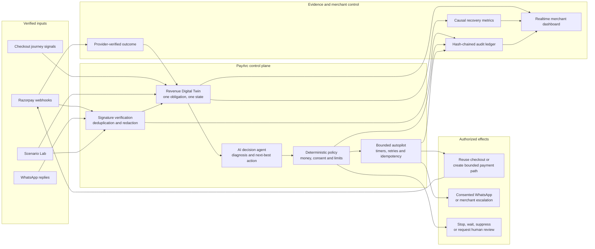

# PayArc

**AI revenue recovery that knows when to act, when to wait, and when to stop.**

PayArc is a zero-trust revenue-recovery control plane built for the Razorpay AI Buildathon. It detects revenue at risk, diagnoses why it is slipping away, chooses the least disruptive intervention, executes a bounded recovery workflow, and proves the money recovered.

The merchant manages exceptions. PayArc handles eligible recovery at transaction volume.

## Architecture



The AI is deliberately **not** allowed to move money or contact customers. It receives minimized failure features and proposes a structured action. Deterministic policy owns the amount, currency, consent, timing, contact budget, approval threshold, provider health, treatment cohort, and kill switch. Only an authorized action reaches the executor.

## The problem PayArc solves

Revenue rarely disappears in one clean step. A bank can degrade, a shopper can abandon checkout, a mandate can fail repeatedly, or a B2B invoice can be blocked by a missing PO. Treating every event as “send another payment link” creates duplicate-payment risk, retry storms, customer fatigue, and inflated recovery claims.

PayArc closes the loop:

`detect → unify → diagnose → decide → authorize → execute → verify → stop → measure`

It prefers the path already available—an active checkout or provider-managed retry—and creates a replacement payment path only when necessary.

## Revenue Autopilot pipelines

Each sidebar page represents one part of the same revenue graph. This diagram shows what enters each pipeline, what PayArc decides, and where it stops.

```mermaid
flowchart TB
    subgraph P1[Overview]
        direction LR
        O1[All revenue obligations] --> O2[Live risk and recovery totals] --> O3[Exceptions for merchant]
    end

    subgraph P2[Portfolio optimizer]
        direction LR
        P21[Recoverable obligations] --> P22[Estimate natural vs intervention lift] --> P23[Rank within action budget] --> P24[Run bounded batch]
    end

    subgraph P3[Payment intelligence]
        direction LR
        P31[Correlated failure burst] --> P32[Engage circuit breaker] --> P33[Wait for quiet window] --> P34[Release 25 percent canary]
    end

    subgraph P4[Checkout journeys]
        direction LR
        P41[Observe customer session] --> P42{Customer active?}
        P42 -->|Yes| P43[Suppress duplicate outreach]
        P42 -->|No| P44[Reuse valid checkout]
        P44 --> P45[Bounded link only if expired]
    end

    subgraph P5[Recurring revenue]
        direction LR
        P51[Subscription or mandate failure] --> P52[Honor provider retry] --> P53[Check bank and duplicate-debit risk] --> P54[Advance one safe step]
    end

    subgraph P6[B2B receivables]
        direction LR
        P61[Overdue invoice] --> P62[Resolve PO or GST blocker] --> P63[Contact buyer] --> P64[Promise, dispute or paid] --> P65[Track or reconcile]
    end

    subgraph P7[Promises and voice]
        direction LR
        P71[Consented Hinglish conversation] --> P72[Capture structured intent] --> P73[Pause until promise due] --> P74[One reminder] --> P75[Paid, opt-out or merchant review]
    end
```



| Page | What PayArc automates | What the merchant sees |
| --- | --- | --- |
| **Overview** | Aggregates every obligation and verified outcome | At-risk, incremental recovered, protected revenue, promises, and exceptions |
| **Portfolio optimizer** | Ranks work by expected incremental value after natural recovery, cost, fatigue, and risk | Selected and deferred actions inside a daily execution budget |
| **Payment intelligence** | Clusters transient failures, holds retries, and performs staged recovery | Failure rate, affected value, retries prevented, and canary release |
| **Checkout journeys** | Observes active shoppers and conserves valid Razorpay checkout paths | Session stage, current decision, timer, and recovered state |
| **Recurring revenue** | Sequences subscription and mandate attempts without duplicate debit | Provider retry, method-update requirement, and bounded attempt plan |
| **B2B receivables** | Resolves invoice blockers before outreach and records the buyer outcome | `Resolve blocker → Contact → Promise / Dispute / Paid` |
| **Promises & voice** | Converts consented Hinglish responses into auditable promises and stopping rules | Live pipeline, due timer, reminder budget, escalation, and closure |

## What makes PayArc different

### Recovery Decision Passport

Every recommendation explains four things:

- **Causal proof:** compares treatment with a deterministic holdout instead of claiming natural recovery.
- **Path conservation:** reuses a valid checkout or provider retry before creating another link.
- **Safety envelope:** records authoritative amount, currency, expiry, consent, limits, and approval requirements.
- **Counterfactual:** shows why intervening is better than waiting—or why waiting is safer.

### Permanent Smart Recovery Session

The customer receives one stable PayArc URL per obligation. Its safe destination can change from cooldown, to an existing checkout, to UPI, to a bounded Razorpay Test Mode path, and finally to a verified receipt—without repeatedly messaging the customer.

### Failure-swarm protection

Three matching transient failures inside two minutes become one provider incident. PayArc holds unsafe retries, waits for five quiet minutes, then releases a 25% canary. This converts many noisy failures into one controlled recovery decision.

### Intent-aware, fatigue-safe outreach

The phone number is resolved just in time from trusted Razorpay data. Signed replies understand opt-out, promise-to-pay, UPI preference, and already-paid claims. Contact limits are enforced atomically across every case belonging to the customer.

## Scenario Lab and five-minute demo

Scenario Lab has three clearly labeled modes:

1. **Revenue Autopilot demos** create fresh records on all seven merchant pages and provide an **Open result** button.
2. **Isolated simulations** prove classification, recovery, replay defense, forged-signature rejection, prompt-injection containment, and out-of-order safety without polluting merchant revenue.
3. **Razorpay Test Mode Checkout** creates a genuine Test Order and accepts a Recovery Case only through the signed Razorpay webhook.

Recommended pitch flow:

1. Open **Scenario Lab → Full autopilot batch** to populate the entire dashboard.
2. Show **Portfolio optimizer** selecting work by incremental value.
3. Run **Payment degradation** and show the circuit breaker.
4. Run **Checkout abandonment** and show checkout reuse instead of a second link.
5. Run **B2B invoice collection**, resolve the blocker, contact the buyer, and record a promise.
6. Open **Promises & voice** and show the timed pipeline and stopping rules.
7. Finish with a genuine Razorpay Test Mode failure, automatic Recovery Case, verified recovery, metrics, and audit proof.

## Implemented safety guarantees

- Verify the exact raw Razorpay body with HMAC before parsing.
- Rotate webhook secrets without accepting modified payloads.
- Deduplicate and process provider events idempotently.
- Redact stored webhook payloads and avoid persisted plaintext contact details.
- Re-read provider truth before creating or closing a payment path.
- Use atomic job claiming, bounded concurrency, timers, backoff, and idempotency keys.
- Stop on verified payment, opt-out, expiry, cancellation, pause, fatigue, risk, or kill switch.
- Keep holdout cohorts free from intervention for honest uplift measurement.
- Append important transitions to a tamper-evident hash chain.

## Quick start

Requirements: **Node.js 24+**.

```bash
npm install
cp .env.example .env
npm test
npm run build:ui
npm run dev
```

Open <http://127.0.0.1:3000>. Default mock mode requires no external credentials.

For frontend hot reload, keep the API running and start `npm run dev:ui` in a second terminal, then open <http://127.0.0.1:5173>.

## Razorpay Test Mode

1. Generate a Razorpay **Test Mode** API key.
2. Expose the local server through an HTTPS tunnel.
3. Add `https://your-host/webhooks/razorpay` as the webhook URL with a separate webhook secret.
4. Configure `.env`:

```dotenv
PAYMENT_PROVIDER_MODE=razorpay
PUBLIC_BASE_URL=https://your-host.example
RAZORPAY_KEY_ID=rzp_test_...
RAZORPAY_KEY_SECRET=...
RAZORPAY_WEBHOOK_SECRET=...
AUTO_ACTIONS_ENABLED=true
EXTERNAL_ACTIONS_ENABLED=true
```

Never reuse the API key secret as the webhook secret. PayArc rejects live Razorpay credentials.

Supported signed events:

- Payments: `payment.failed`, `payment.authorized`, `payment.captured`, `order.paid`
- Provider health: `payment.downtime.started`, `payment.downtime.updated`, `payment.downtime.resolved`
- Recurring: `subscription.pending`, `subscription.halted`, `subscription.charged`, `subscription.activated`
- Outcomes: `payment_link.paid`, `payment_link.partially_paid`, `payment_link.expired`, `payment_link.cancelled`

Checkout, B2B, mandate, conversation, and promise workflows live in the Revenue Digital Twin; they do not claim unsupported Razorpay webhook coverage.

## Optional AI and WhatsApp connections

PayArc works without an external model through its deterministic fallback. Groq is the free-model path; OpenAI is optional.

```dotenv
AI_PROVIDER=groq
GROQ_API_KEY=...
GROQ_MODEL=openai/gpt-oss-20b
```

For unattended WhatsApp delivery, configure Meta Cloud API. Without it, PayArc prepares a consented click-to-chat message.

```dotenv
WHATSAPP_MODE=cloud_api
WHATSAPP_ACCESS_TOKEN=...
WHATSAPP_PHONE_NUMBER_ID=...
WHATSAPP_TEMPLATE_NAME=recovery_payment_link
WHATSAPP_TEMPLATE_LANGUAGE=en_US
WHATSAPP_APP_SECRET=...
WHATSAPP_WEBHOOK_VERIFY_TOKEN=...
```

The callback is `https://your-host/webhooks/whatsapp`. Provider and messaging credentials are never exposed to the AI model.

## Technology and repository map

- **Runtime:** Node.js, TypeScript, Fastify, SQLite
- **Dashboard:** React, Vite, Recharts, responsive Razorpay-inspired UI
- **Integrations:** Razorpay Test Mode, Groq/OpenAI decision adapters, WhatsApp Cloud API
- **Realtime:** authenticated server-sent events
- **Verification:** 60 automated tests covering recovery, provider contracts, automation, security, and concurrency

```text
src/
  app.ts                 Routes and orchestration
  domain/                Recovery and revenue models
  providers/             Razorpay, AI, WhatsApp, and mock adapters
  services/              Ingestion, decisions, policy, automation, and demos
  storage/database.ts    SQLite repositories, metrics, and audit chain
frontend/src/            Merchant dashboard and Smart Recovery Session UI
tests/                   Unit, integration, security, and end-to-end tests
docs/                    Detailed architecture, API, and operator guide
```

## Verification

```bash
npm run typecheck
npm test
npm run build:ui
```

Further documentation:

- [Architecture and trust boundaries](./docs/ARCHITECTURE.md)
- [API reference](./docs/API.md)
- [Merchant and judge guide](./docs/USER_GUIDE.md)
