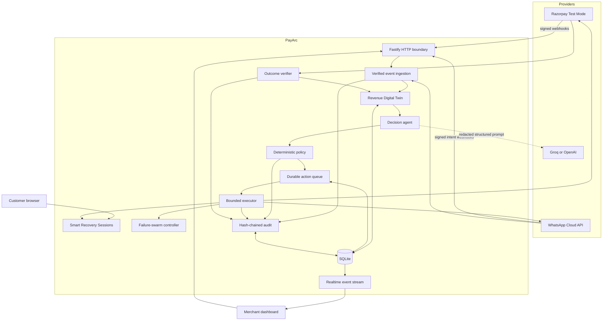
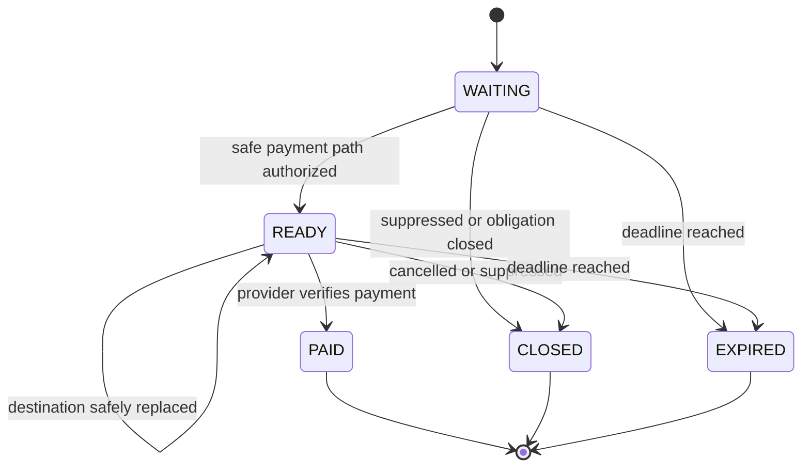
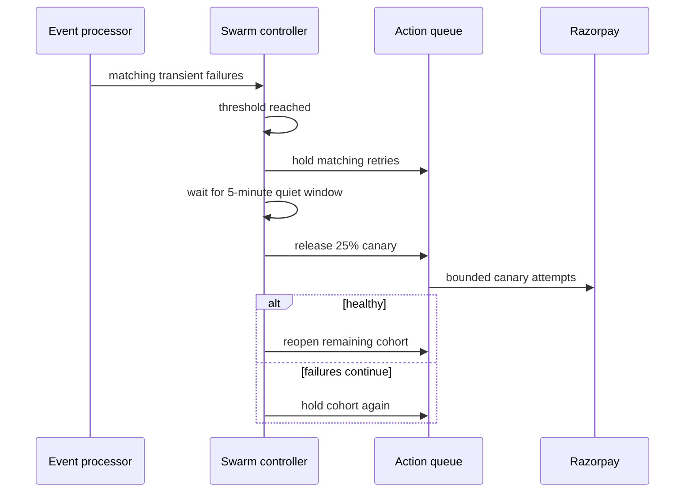
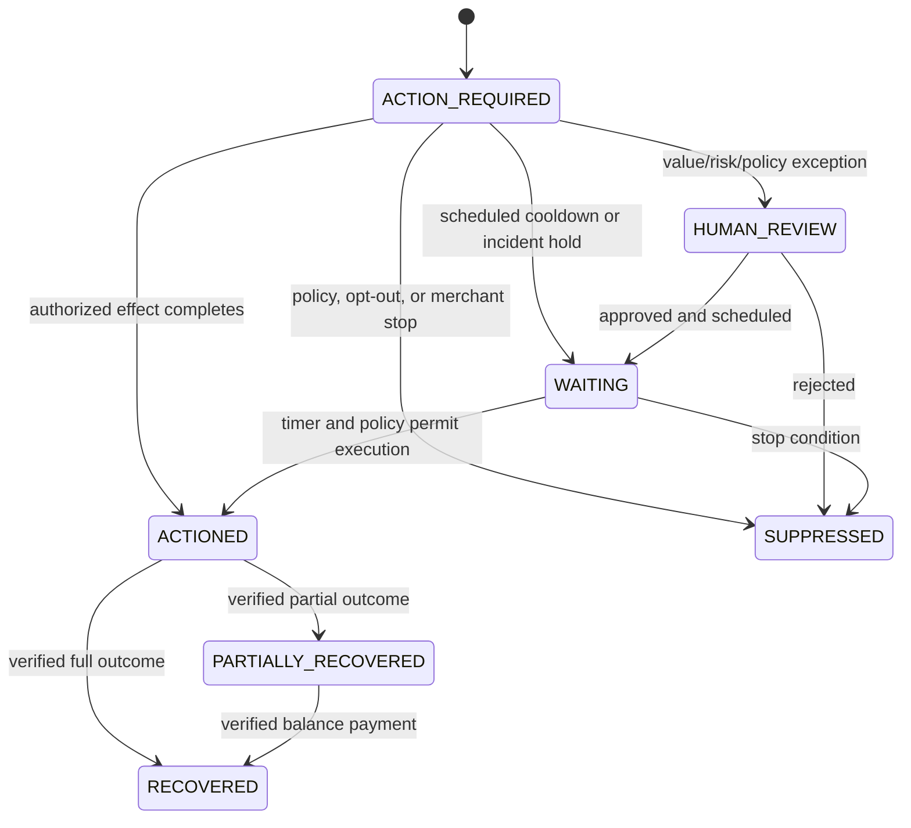
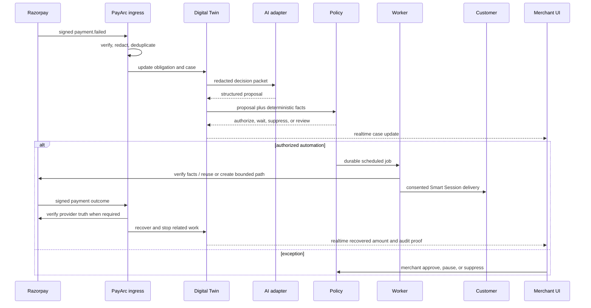

# PayArc architecture

## Design goal

PayArc is a revenue-recovery control plane, not a payment processor. Razorpay remains the source of truth for payments. PayArc decides whether recovery is useful and safe, coordinates the next bounded step, observes the result, and records evidence.

The architecture optimizes four things together:

1. incremental recovered revenue;
2. low duplicate-debit and compliance risk;
3. low customer fatigue;
4. an explainable, tamper-evident decision trail.

## Non-negotiable invariants

- No external action before deterministic policy authorization.
- No paid/recovered status based only on a customer or AI claim.
- No second checkout while a valid original path can be conserved.
- No customer contact without consent evidence and available fatigue budget.
- No duplicate effect when an event, job, or webhook is delivered more than once.
- No raw provider secret, phone number, email address, or inbound message body in durable case state.
- No model access to Razorpay or WhatsApp credentials or execution tools.
- No recovery attribution without a verified outcome and a treatment/control baseline.

## System context

## Process topology

The hackathon build runs as one Node.js process so it is easy to demonstrate and deploy:

- Fastify serves authenticated merchant APIs, public Smart Session routes, provider webhooks, and the built frontend.
- A polling autopilot worker claims due jobs from SQLite.
- Server-sent events publish state changes to active dashboards.
- SQLite provides transactions, uniqueness constraints, and durable local state.

The boundaries are deliberately service-shaped. In production, ingress, decision workers, action workers, realtime delivery, and public recovery sessions can be split without changing the domain model.

## Component responsibilities

### HTTP and webhook boundary

The route layer authenticates merchant APIs and separates them from public or provider-authenticated routes. Razorpay signatures are computed from the exact raw body with HMAC-SHA256 before JSON interpretation. WhatsApp callbacks use Meta verification and `X-Hub-Signature-256` validation.

Webhook acceptance is kept small: verify, redact, deduplicate, persist, and acknowledge. Expensive decisions and provider calls happen asynchronously.

### Normalizer and Revenue Digital Twin

Supported provider payloads are converted into canonical events. The signed Razorpay boundary currently admits 15 payment, order, downtime, subscription, and Payment Link events. The twin also models checkout, mandate, receivable, conversation, and promise objects registered through their dedicated local APIs/scenarios. It joins fragmented facts into one obligation:

- source entity and provider IDs;
- amount, currency, due/recovered value;
- payment, checkout, subscription, invoice, mandate, or promise state;
- pseudonymous customer token;
- active payment path and provider-health context;
- consent, opt-out, and contact-budget state.

The obligation is the unit of revenue. Cases and actions may change many times without double-counting the underlying amount.

### Decision agent

The agent receives a redacted feature packet and returns a strict proposal:

- action type;
- confidence;
- short explanation;
- delay/cooldown;
- whether human approval is recommended.

Groq and OpenAI adapters implement the same contract. `AI_PROVIDER=auto` prefers a configured Groq adapter, then OpenAI, then deterministic logic. Malformed, late, or unavailable model output falls back safely.

The model proposes; it does not authorize or execute.

### Deterministic policy engine

Policy evaluates facts that must not depend on probabilistic output:

- treatment versus control cohort;
- global autopilot and provider-execution switches;
- case/obligation terminal state;
- existing valid checkout or scheduled provider retry;
- allowed currency and verified amount;
- approval threshold;
- merchant pause and kill switch;
- consent/opt-out state;
- per-case and customer-wide fatigue budgets;
- cooldown and link expiry;
- provider incident or failure swarm;
- risk/compliance and merchant-owned blockers.

It can approve, schedule, wait, suppress, or send the case for human review. The policy result and reason become part of the Recovery Decision Passport.

### Durable scheduler and executor

Incoming events create durable jobs that workers claim transactionally. Authorized recovery actions persist their own `nextAttemptAt`, attempt budget, and status. The current single-process server prevents overlapping timer runs; action concurrency is bounded by `WORKER_CONCURRENCY`, and stable provider idempotency/reference keys protect retries. A multi-replica deployment must add database row leasing for due actions, as described under production scale-out.

Every provider mutation receives a stable idempotency/reference key derived from the PayArc action. A retry therefore resumes the same logical effect rather than creating a new one.

### Provider adapters

The Razorpay adapter is the only component that knows Razorpay authentication and request shapes. It supports Test Mode payment/order/link/invoice verification and bounded Payment Link lifecycle operations. The WhatsApp adapter supports click-to-chat demonstration and approved-template Cloud API delivery.

Adapters return normalized provider facts; domain services do not rely on raw response shapes.

### Smart Recovery Session

A recovery session creates one stable public PayArc URL for an obligation. Its server-side state determines what the customer sees:

The public route never accepts a client-supplied amount or provider destination. It resolves the current state from the obligation. A provider incident can hold a session without invalidating the URL; a customer preference can switch the authorized path; verified payment turns it into a receipt.

### Failure-swarm controller

Transient failures are correlated by provider/failure fingerprint and time bucket. Three matching events within two minutes open a swarm:

This converts many case-level actions into one portfolio-level decision and prevents PayArc from amplifying a provider outage.

### WhatsApp intent boundary

Outbound delivery resolves the contact from Razorpay immediately before sending, verifies consent evidence in order/payment notes, reserves the customer-wide fatigue budget atomically, and records only masked/pseudonymous delivery evidence.

Inbound messages follow this flow:

1. Verify Meta signature against the raw body.
2. Deduplicate by WhatsApp message ID.
3. Map the sender token to the relevant active obligation without persisting the phone number.
4. Classify bounded intent: opt-out, promise, UPI preference, already-paid, or unknown.
5. Apply deterministic consequences.
6. For already-paid, query Razorpay and close only if provider truth agrees.
7. Append redacted intent/result evidence to the audit chain.

Unknown free text does not authorize a financial action.

### Outcome verifier and metrics

Signed Razorpay outcomes are correlated to obligations and rechecked where necessary. Partial payments update recovered value without closing the obligation. Full payment marks the case recovered and the Smart Session paid; terminal-state policy makes later actions ineligible while historical records remain available for audit. Expiry or cancellation does not count as recovered revenue.

Metrics distinguish:

- revenue at risk;
- gross recovered revenue;
- treatment recovery;
- control/natural recovery;
- incremental recovery/lift;
- protected revenue and prevented unsafe retries;
- open/kept promises;
- Smart Session opens and conversions;
- fatigue stops and swarm-held actions.

### Audit ledger

Every material entry contains the previous hash and a hash of its canonical content. Validation recomputes the chain. This detects edits, deletion/reordering within the checked chain, and inconsistent state explanations. It is tamper-evident, not a replacement for external immutable storage.

## Core state transitions

### Case lifecycle

Labels in the UI are title-cased versions of these canonical states. Counts are derived from current database state rather than increment/decrement counters, so suppression, recovery, and new cases remain consistent.

### Action lifecycle

An action moves through proposed, policy-authorized/scheduled, executing, succeeded/failed, paused, or suppressed states. Failed provider calls can be retried only while the same action remains eligible and its idempotency key is retained.

## End-to-end payment recovery sequence

## Concurrency and idempotency

- Provider event IDs have unique constraints.
- Scenario event IDs occupy a separate namespace.
- One obligation owns the economic amount even when it has multiple provider objects.
- Incoming-event job claiming occurs transactionally; multi-replica due-action claiming requires the production row-lease evolution.
- Action references remain stable across retries.
- Payment-link creation checks current provider/path state before mutation.
- Contact-budget reservation and delivery recording are atomic.
- WhatsApp inbound message IDs are deduplicated.
- Recovery is computed from verified cumulative outcomes, not additive webhook counts.

## Realtime synchronization and URL persistence

The UI subscribes to authenticated server-sent events. Mutations publish invalidation/state messages and the client refreshes the relevant query without waiting for a page reload. The selected page and case ID are represented in the URL, so refreshing or sharing a merchant route returns to the same view. Public Smart Session state is fetched independently and contains no merchant-only data.

## Data protection

PayArc stores pseudonymous customer tokens and redacted evidence. Contact data is fetched just in time from Razorpay and held only long enough to construct an approved delivery request. Webhook bodies are sanitized before persistence. Secrets are read from environment variables and never returned by readiness APIs.

Provider-facing errors are normalized before reaching the UI. Logs and audit entries avoid credentials, raw authorization headers, contact details, and inbound free text.

## Integration coverage boundary

| Boundary | Implemented input |
| --- | --- |
| Signed Razorpay webhooks | payment failed/authorized/captured, order paid, payment downtime started/updated/resolved, subscription pending/halted/charged/activated, Payment Link paid/partially paid/expired/cancelled |
| Razorpay Test API reads/writes | orders, payments, order payments, outstanding subscription invoice, Payment Link lookup/create/fetch/cancel |
| Revenue Digital Twin APIs | checkout journeys, incidents, subscriptions, mandates, receivables, conversations, promises, portfolio optimization |
| Scenario Lab | isolated edge cases plus genuine Razorpay Test Order/Checkout proof runs |
| WhatsApp | click-to-chat preparation, Cloud API template delivery, signed inbound bounded intent |

This separation is intentional: modeled hackathon playbooks remain visible without being described as provider webhook integrations that do not exist.

## Failure behavior

| Failure | Safe behavior |
| --- | --- |
| Invalid provider signature | Reject before parsing or mutation |
| Duplicate webhook | Return idempotent success; do not duplicate state/effects |
| Out-of-order event | Preserve terminal provider truth and reconcile safely |
| AI timeout or invalid JSON | Use deterministic fallback; never bypass policy |
| Razorpay unavailable | Keep/schedule action, open or join swarm, do not create alternatives blindly |
| WhatsApp unavailable | Record delivery failure; retain the Smart Session; respect contact caps |
| Missing consent/contact | Do not send; surface readiness/exception reason |
| Concurrent worker claim | Only transactional winner executes |
| Customer says paid | Verify Razorpay before closing |
| Customer says STOP | Suppress customer-wide contact immediately |
| Audit mismatch | Mark ledger invalid and surface Security Center failure |

## Production scale-out

The current SQLite topology is appropriate for a hackathon demonstration. A production deployment can evolve as follows:

- PostgreSQL for shared transactional state and row-level job claiming;
- a distributed queue for scheduled work and dead-letter handling;
- Redis for rate limits, short leases, and cross-instance fatigue locks;
- managed KMS/secret storage and audited secret rotation;
- separate stateless ingress, decision, action, session, and realtime services;
- centralized metrics, tracing, and alerting;
- immutable external audit anchoring;
- tenant isolation, RBAC, data-retention controls, and regional routing.

The AI/policy/executor separation and domain idempotency keys remain unchanged.

## Source map

| Area | Primary location |
| --- | --- |
| Routes and server composition | `src/app.ts` |
| Domain vocabulary and state machines | `src/domain/` |
| Durable schema, repositories, metrics, and audit | `src/storage/database.ts` |
| Decision and AI adapters | `src/providers/decision-provider.ts` |
| Policy authorization | `src/services/policy-engine.ts` |
| Ingestion and normalization | `src/services/webhook-ingestor.ts`, `src/services/razorpay-events.ts` |
| Autopilot, Smart Sessions, and execution | `src/services/recovery-engine.ts` |
| Razorpay integration | `src/providers/razorpay-provider.ts` |
| Swarms and portfolio intelligence | `src/services/revenue-intelligence.ts` |
| WhatsApp delivery and intent | `src/services/recovery-channel-orchestrator.ts`, `src/providers/whatsapp-provider.ts` |
| Merchant/public UI | `frontend/src/` |
| End-to-end verification | `tests/e2e.test.ts` |

Some filenames may combine related services as the implementation evolves; the stable boundary is the responsibility described above.
